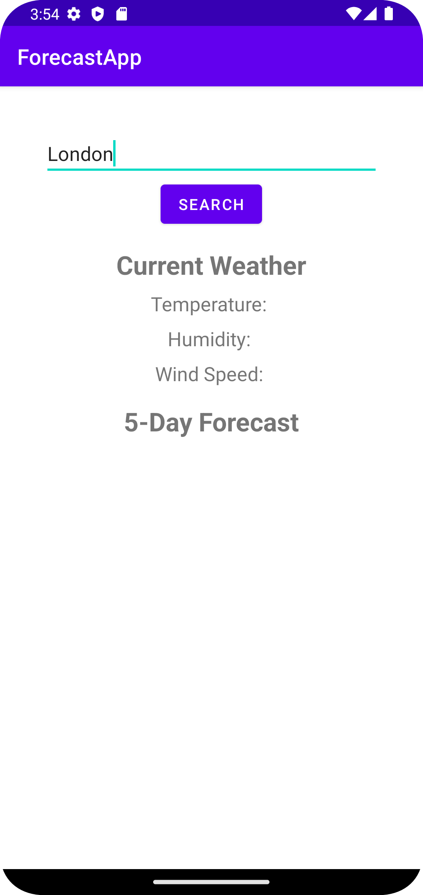
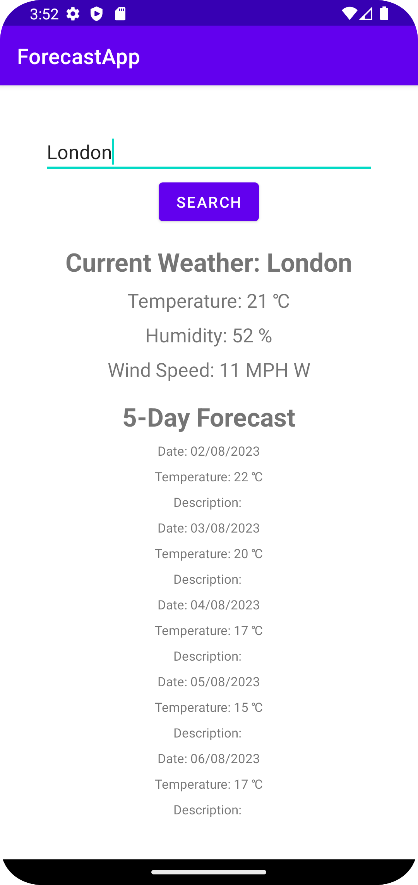

# ForecastApp

ForecastApp is a powerful weather application built with the MVVM architecture pattern, ensuring a clear separation of concerns and easy maintenance of code. It aims to provide users with a seamless experience while accessing weather information. Whether you want to check the current weather in your city or plan a trip to another location, ForecastApp has got you covered.


## Acknowledgements


-  Real-time Weather Updates: Get the latest weather data in real-time, thanks to the MVVM architecture that efficiently manages data flow and updates.

-    Accurate Forecasts: Access detailed weather forecasts for up to 5 days, helping you plan ahead and stay prepared.

-    Location-based Weather: Simply enter the name of a city, and ForecastApp will retrieve weather data specific to that location.

-    User-Friendly Interface: The MVVM architecture enhances the separation of UI and business logic, resulting in an elegant and easy-to-navigate interface.

-    Seamless Integration: ForecastApp integrates with the OpenWeatherMap API, a reliable source for weather data, to deliver precise information.

## APis
    OpenWeatherMap API:
        Description: OpenWeatherMap is a popular weather data provider that offers a wide range of weather-related information, including current weather conditions, forecasts, and historical data.
        Usage: ForecastApp makes API calls to OpenWeatherMap to fetch current weather data and weather forecasts for specified locations. The API returns JSON responses that are parsed and displayed in the app's user interface.

    Google Maps Geocoding API:
        Description: The Google Maps Geocoding API is used to convert location names (e.g., city names) into geographical coordinates (latitude and longitude) that can be used to query weather data from the OpenWeatherMap API.
        Usage: When a user enters a location name in ForecastApp, the app uses the Google Maps Geocoding API to obtain the latitude and longitude coordinates for that location. These coordinates are then passed to the OpenWeatherMap API to retrieve the corresponding weather information.
        
## Tools


```bash
ForecastApp is built using the latest tools and technologies, combined with the MVVM architecture, to provide a seamless and efficient performance:

   - Kotlin: The app is developed in Kotlin, taking advantage of its concise and expressive syntax.

   - Android Architecture Components: ForecastApp utilizes Android Architecture Components like ViewModel and LiveData, adhering to the MVVM pattern.

   - Retrofit: Retrofit is employed for making network requests to the OpenWeatherMap API and fetching weather data.

   - Hilt: The application uses Hilt for dependency injection, ensuring a clean and maintainable codebase.
```
    
## Features

-    Current Weather: Display the current weather condition, temperature, humidity, wind speed, and more for any specified location.

-    Weather Forecast: Access a detailed weather forecast for the upcoming days, including temperature trends and weather conditions.

-    Search Functionality: Easily search for weather information by entering the name of a city or location.

-    Error Handling: Implement robust error handling, facilitated by the MVVM architecture, to ensure the app gracefully handles network issues and other potential errors.

## Future Features
ForecastApp is an ongoing project with several exciting features planned for future updates:

-    Weather Alerts: Implement push notifications, coordinated by the ViewModel, to provide users with timely weather alerts and warnings.

-    Weather Maps: Integrate interactive weather maps to visualize weather patterns and forecasts on a map.

-    Personalized Preferences: Allow users to set their preferences for temperature units, language, and other settings.

-    Widget Support: Develop home screen widgets, managed by the ViewModel, for quick access to weather updates without opening the app.

## Screenshots




## 🚀 About Me
Let's make it work

