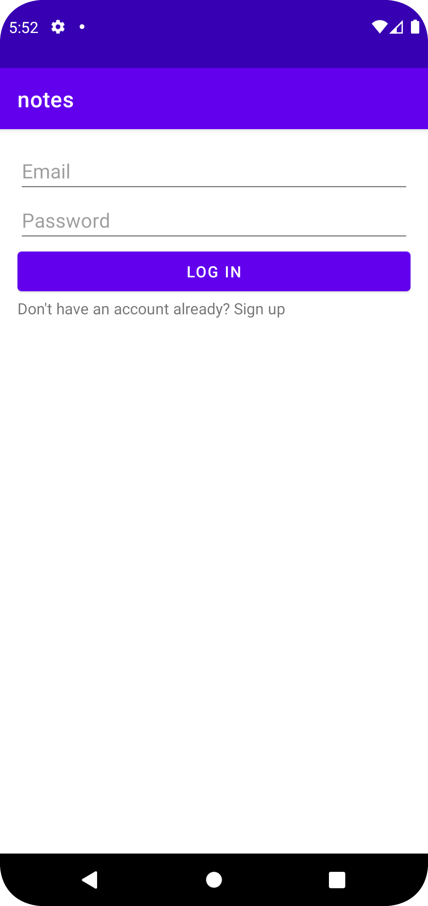
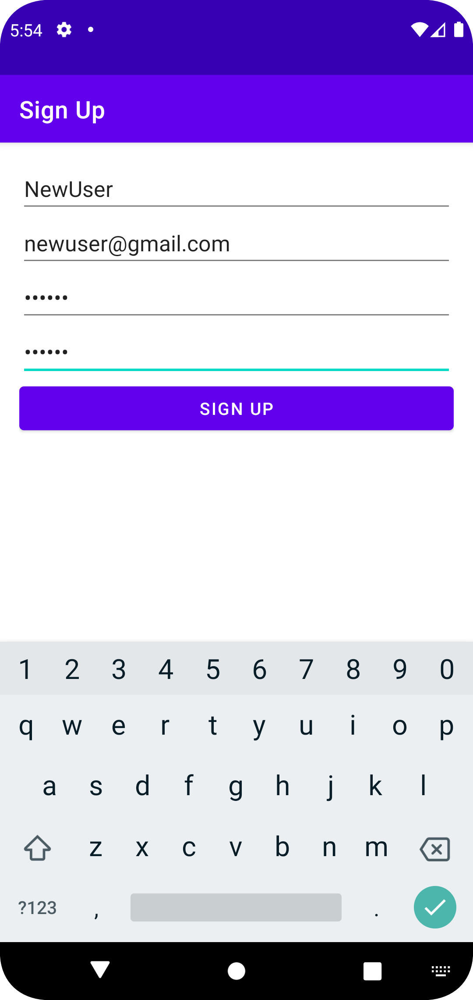
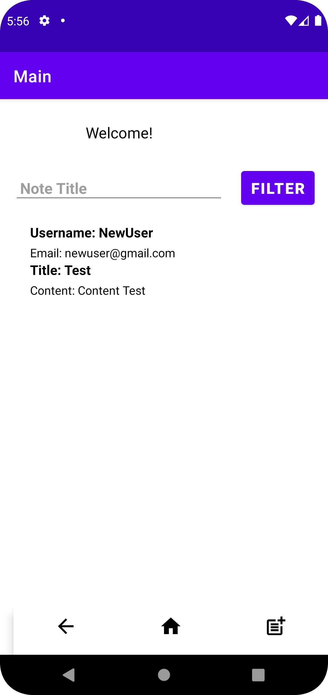
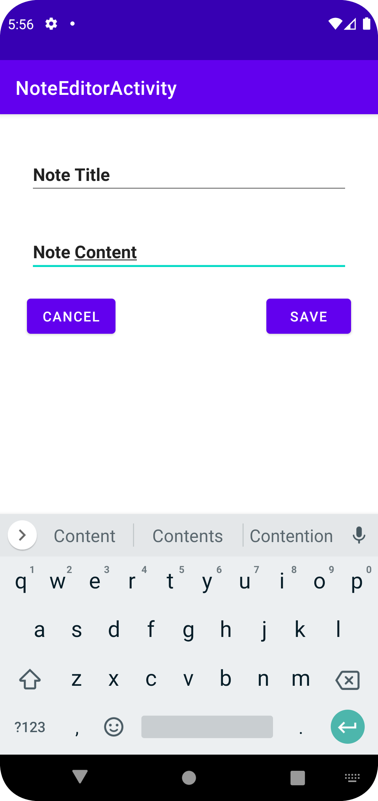

# NotesApp

NotesApp is a beautifully designed Android application that allows users to create, view, and filter notes. It is built with a focus on clean and intuitive user interface design and incorporates various key Android development concepts.

## Features

- User Authentication: Users can securely create accounts or log in using Firebase Authentication.

- Note Creation and Viewing: Once logged in, users can create new notes with a title, content, and other details. All notes are displayed in a RecyclerView, presented as cards showing the note's information.

- Filtering Notes: A search bar is provided, enabling users to filter notes based on their titles. The RecyclerView dynamically updates to display only the notes matching the filter criteria.

- Bottom Navigation: The app includes a user-friendly BottomNavigationView for seamless navigation between different sections.

## Technical Achievements

- Firebase Integration: The app effectively integrates Firebase Authentication for secure user login and registration.

- Room Database: It employs Room Persistence Library to store user notes in a local SQLite database.

- RecyclerView: Notes are efficiently displayed using a RecyclerView with a custom adapter, providing a smooth scrolling experience.

- Coroutines and LiveData: Asynchronous tasks are handled with Kotlin coroutines and LiveData, ensuring responsiveness.

## Screenshots

## Getting Started

1. Clone the repository: `git clone https://github.com/your_username/NotesApp.git`

2. Open the project in Android Studio.

3. Build and run the app on an Android emulator or device.

## Future Enhancements

- Note Editing: Allow users to edit existing notes.

- Note Deletion: Enable users to delete notes they no longer need.

- Note Categorization: Implement the ability to categorize notes.

- Dark Mode: Add support for dark mode to enhance user experience.

## Credits

This project was created by [Your Name](https://github.com/your_username). Feel free to contribute and make it even better!

## License

The NotesApp is open-source and available under the [MIT License](LICENSE). Feel free to use, modify, and distribute the code. We welcome your feedback and contributions!